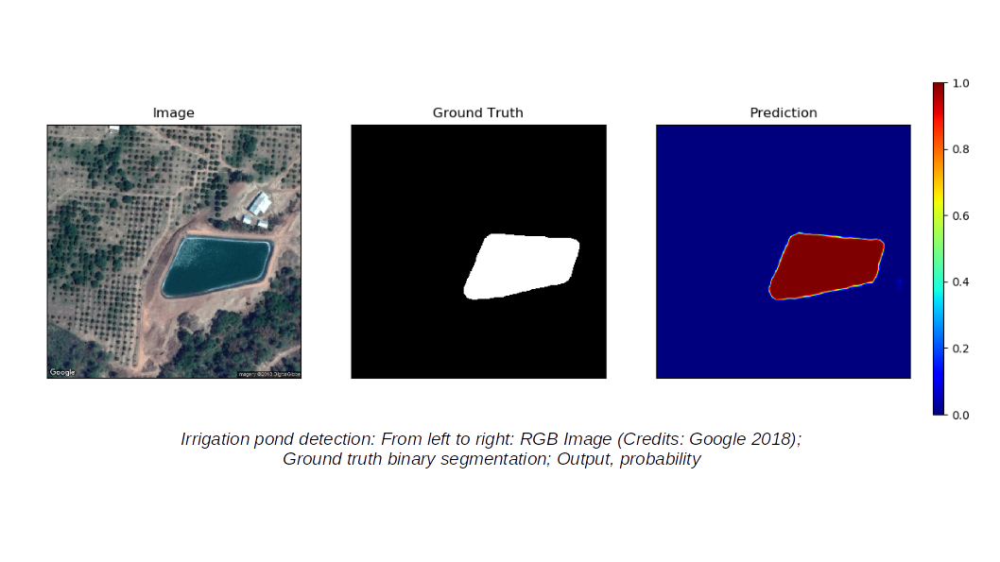
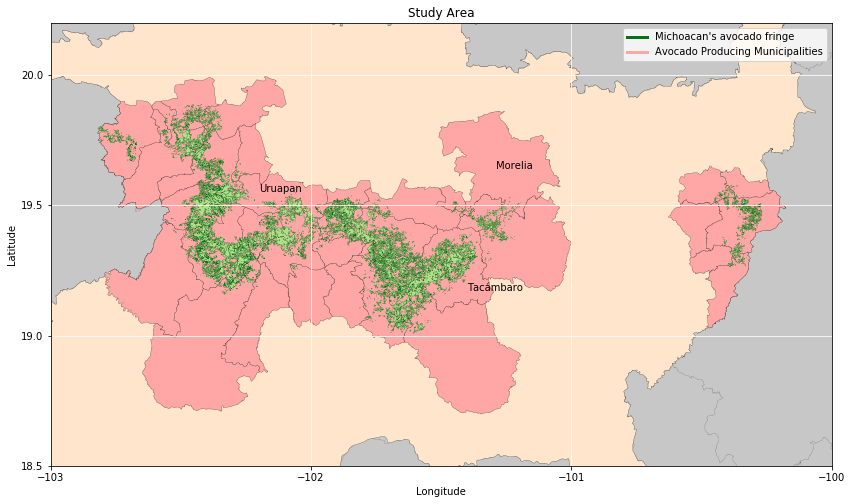
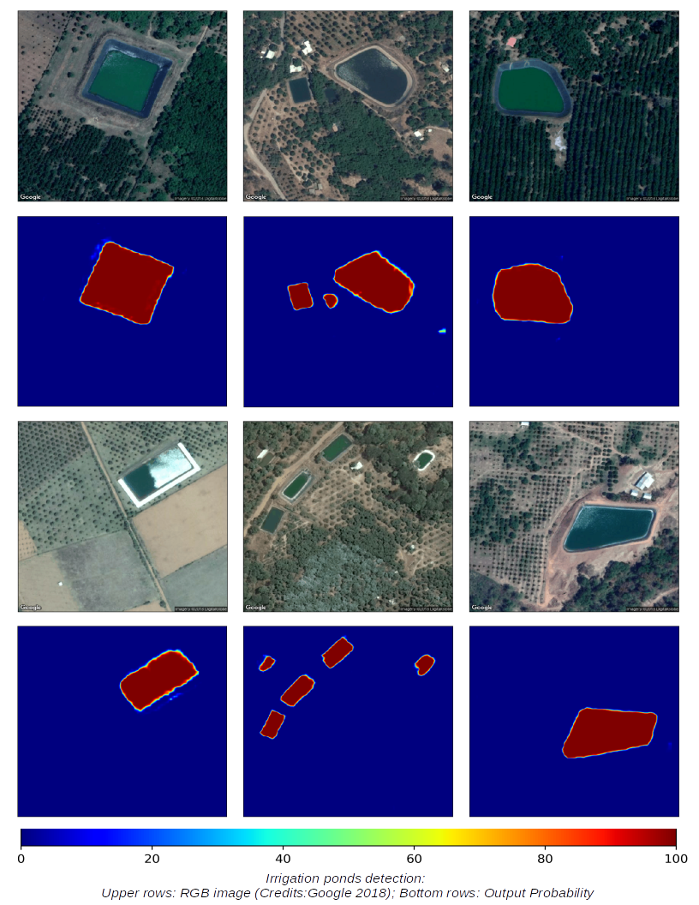
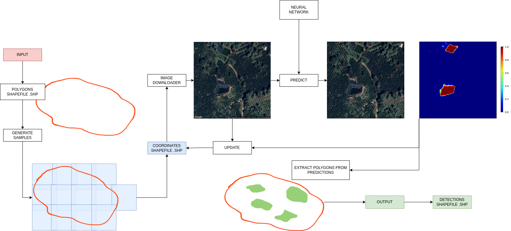

# Agricultural-Water-Storage-Pool

Detects agricultural water reservoir or pools with geomembrane lining using [google maps satellite imagery](https://developers.google.com/maps/documentation/maps-static/overview). It uses a Fully Convolutional Network with ResNet50 as a feature extractor. 



We trained our model in the areas with the highest avocado production in Mexico (the green gold fringe at Michoacan state)



Our fine-tuned model detects water reservoir greater than 230 m² of size with an F1 score of 0.91 (Recall=0.90, Precision=0.92).




# Requirements

The codes have been tested on `linux mint` using `python 3.7.17`. You can install the required python version with [pyenv](https://github.com/pyenv/pyenv)

Then, create your virtual environment:
```shell
pip install -r requirements.txt
```

Also, you need to install `python3-rtree` package if is not installed on your computer:

```shell
sudo apt-get update
sudo apt-get install -qy python3-rtree
```

# Usage
Below image describes process logic. The `input` is an `ESRI shapefile`. A stratified grid of image center coordinates is generated. Sample images are donwloaded and parsed to the fully convolutional neural network. Then polygons are extracted from prediction images and an output `ESRI shapefile` is generated with the detected  water reservoirs polygons.




To generate the sample grid, use the `generate_samples.py` module:

```shell
python generate_samples.py
```

To download the google images use `google_staticmap_image_downloader.py` module:

```shell
python google_staticmap_image_downloader.py
```

To use the neural network and generate prediction images, use the `predict.py` module:

```shell
python predict.py
```

Finally, to extract the polygons and generate water reservoirs ESRI file use the `polygons_extraction.py` module:

```shell
python polygons_extraction.py
```


# Configuration

## Global variables

The module `configs.vars_globals` contains main global variables:

```python
# Directories

DIRECTORY_IMAGES = './data/google_images'
DIRECTORY_PREDICTIONS = './data/prediction_images'
DIRECTORY_SHAPEFILES = './data/shapefiles'
```

* **DIRECTORY_IMAGES (str)**: Directory where `google_staticmap_image_downloader.py` module will store downloaded images.

* **DIRECTORY_PREDICTIONS (str)**: Directory where `predict.py` module will store prediction images.

* **DIRECTORY_SHAPEFILES (str)**: Directory where `generate_samples.py` and `polygons_extraction.py` modules will store their outputs.

```python
# Coordinates Samples File

COORDINATES_FILE = os.path.join(DIRECTORY_SHAPEFILES, 'coordinates.shp')
COORDINATES_CRS_PROJECTION = 'epsg:6372'
```

* **COORDINATES_FILE (str)**: It is the output for the `generate_samples.py` module. It is a stratified grid of image center coordinates. The `google_staticmap_image_downloader.py` and `predict.py` modules will update this file when they are executed.

* **COORDINATES_CRS_PROJECTION (str)**: CRS projection of `COORDINATES_FILE`. It must be in meters unit

```python
# Image spatial parameters

IMAGE_HEIGHT = 552
IMAGE_WIDTH = 552
IMAGE_CHANNELS = 3
IMAGE_RESOLUTION_X = 0.5635245901639344
IMAGE_RESOLUTION_Y = 0.5635245901639344
IMAGE_CROP_SIZE = 20
IMAGE_DTHR = 250
```

* **IMAGE_HEIGHT (int)**: Image height in pixels. The `google_staticmap_image_downloader` module uses this parameter to download the images. 

* **IMAGE_WIDTH (int)**: Image width in pixels. The `google_staticmap_image_downloader` module uses this parameter to download the images.

* **IMAGE_CHANNELS (int)**: Total of channels in the downloaded images. The module `google_staticmap_image_downloader` by default downloads images in RGB format.

* **IMAGE_RESOLUTION_X (float)**: X-axis pixel resultion. Pixel resolution is calculated using [this function](https://github.com/ishukshin/image-coordinates.py)

* **IMAGE_RESOLUTION_Y (float)**: X-axis pixel resultion. Pixel resolution is calculated using [this function](https://github.com/ishukshin/image-coordinates.py)

* **IMAGE_CROP_SIZE (int)**: Total of pixels to hide in the image. Crop size is applied to each image border.

* **IMAGE_DTHR (int)**: Distance between each image center (X and Y direction). The `generate_samples.py` module use this parameter to generate the stratified grid of samples.


```python
# Neural Network

NN_CLASSES = 2
NN_WEIGHTS_FILE = f'./neural_network/Model/weights_{NN_WEIGHTS_ID}.h5'
```

* **NN_CLASSES (int)**: The `predict.py` module works with a binary neural network segmentation.

* **NN_WEIGHTS_FILE (str)**: File with the neural network trained weights.


## Generate samples configuration

```json
{
    "globals": {
        "batch_size": 10000
    },
    "input": {
        "shapefile": {
            "path": "./data/shapefiles/my_input_shapefile.shp"
        }
    },
    "output": {
        "set_as_default": true,
        "shapefile": {
            "path": null
        },
    }
}
```

* **globals.batch_size (int)**: Batch size to work the input file.

* **input.shapefile.path (str)**: Input shapefile used to generate the stratified grid.

* **output.shapefile.set_as_default (boolean)**: If enable, output file will be saved at `configs.vars_globals.COORDINATES_FILE`, otherwise `output.shapefile.path[str]` must be set.


## Google staticmap image downloader configuration

```json
{
    "globals": {
        "n_process": 8,
        "max_images_to_download": 18000
    },
    "input": {
        "api": {
            "url": "https://maps.googleapis.com/maps/api/staticmap",
            "params": {
                "scale": 1,
                "zoom": 18,
                "format": "png32",
                "maptype": "satellite",
                "key": {
                    "load_from_environ": true,
                    "env_variable": "GOOGLE_STATICMAP_API_KEY"
                }
            },
            "timeout": 60
        }
    }
}
```

* **globals.n_process (int)**: Total of threads to use in multiprocessing

* **globals.max_images_to_download (int)**: Total of images to download by execution. After each execution, `configs.vars_globals.COORDINATES_FILE` shapefile is updated with the downloaded images. `configs.vars_globals.COORDINATES_FILE.img_exists` field is used to get the pending images to download in each execution. 

* **input.api.url (str)**: Google staticmap base URL

* **input.api.params (object)**: [Download image parameters](https://developers.google.com/maps/documentation/maps-static/start). The `zoom` parameter is required to calculated pixel resolution

* **input.api.params.key (object)**: To download an image, the downloader requieres an [API key for authentication method](https://developers.google.com/maps/documentation/maps-static/get-api-key). If `input.api.params.key.load_from_environ` is enable, the downloader will use `os.environ[input.api.params.key.env_variable]`, otherwise, API key must be set at `input.api.params.key.env_variable`

* **input.api.timeout (str)**: Timeout in seconds to stop an image request

## Predict configuration

```json
{
    "globals": {
        "batch_size": 32
    }
}
```

* **globals.batch_size (int)**: Batch size to process the downloaded images.

## Polygons extraction configuration

```json
{
    "globals": {
        "batch_size": 32
    },
    "output": {
        "path": "./data/shapefiles/Polyons_<NOW(%Y%m%d_%H%M%S)>_weights_<NN_WEIGHTS_ID>.shp",
        "projection": "epsg:4326"
    }
}
```

* **globals.batch_size (int)**: Batch size to process the prediction images.

* **output.path (str)**: Output file with the extracted polygons from the prediction images. This is a template where `<NOW(dateformat)>` will print the current datetime and `<NN_WEIGHTS_ID>` will print `configs.vars_globals.NN_WEIGHTS_ID` variable (neural network weights identifier).

* **output.projection (str)**: CRS projection for the output shapefile.

